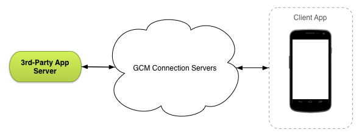

# Android Copernicus Project

&copy; 2015 Michał Ciołczyk, Michał Janczykowski, Wojciech Milewski

Android &amp; Copernicus Integration (IoT AGH)

Controlling the lamps in a smart house.

## Project goals

The goal of the project was to integrate Copenicus-based smart house system with an Android application
 that would allow sending commands to the system and receive incoming messages. Our smart house is equipped
  with a set of devices having a lamp output with on/off switch and a motion sensor. Each device is assigned
   to a single room and all of them have a second button that allows disabling all lamps on current floor.

The Android application is a remote interface for the smart house system. It allows switching lamps on and
 off but also has a feature of an alarm. Once the alarm is switched on, the user will get a notification sent
  over Google Cloud Messaging each time the system detects motion in any of rooms.

## Architecture

There are 3 parts of this project:

* Device part (installed on Copernicus devices) written in Python,
* Server part (running on any host) written in Python,
* Android part (running on phone) written in Java.

### Device part

The device part is running on Copernicus devices. It enables the users to use buttons to control the
 light in the current room and on the whole floor. The button number 1 toggles the light in the current
 room, the button number 2 turns off the light on the whole floor. When the motion is detected, the
 device sends a notification to the multicast group. Also the device listens to the multicast group
 to turn on/off the light if such message comes to it.

### Server part

The server can be running on any host (it needs public IP though). It implements the REST API
 (described below) for the Android device. It sends messages to the multicast group about turning
 on/off the lights in response to the proper HTTP requests. It also enables turning on/off the alarm
 and also listens to the multicast group about the notification on triggering the motion detector.
 When such notification arrives and alarm is turned on, it pushes the notification to registered
 Android devices.

### Android part

The Android part is running on mobile phone. It enables users to switch on/off the lights and turn
 on/off the alarm. It firsts needs to register itself on the server for GCM alarm notifications.
 When registered, the triggering of the alarm will be displayed in Android's notification bar (even
 if the application is not running).

## Communication

All of the parts are cooperate with each other using 3 different ways.

### Multicast group

The devices and the server are communicating using UDP sockets (they are in the same
 multicast group - in our project we used group `234.6.6.6` and port `3666`).
 
#### Message format - lights changing

```
<floor>;<room>;lamp;<mode>
```

In our project floor can be only `1` or `*` (`*` means all floors) and room can be `kitchen`
 or `corridor` or `*` (`*` means all floors). Mode is either `on`, `off` or `toggle`.

#### Message format - motion triggering

```
<floor>;<room>;motion;triggered
```

In our project floor can be only `1` and room can be `kitchen` or `corridor`. Note that here the
 message comes exactly from one source, hence the `*` is not permitted in floor or room fields.

### REST and GCM

The server and Android app are communicating using REST service on the server and GCM. Android app uses
 the REST API on the server to turn on/off lamps and alarm. The GCM is used by the server to push alarm
 messages to the Android app. The REST service in our project was running on port `20666`.
 
#### GCM Architecture



The server (in the picture shown as the 3rd-party app server) sends the message to the Google servers
 (with the recipient set to the correct phone). It is then passed by them to the proper device.

### REST API

#### Change lights message

```
POST /lights/
```

Request body:

```javascript
{
    "floor": "<floor>",
    "room": "<room>",
    "operation": "<operation>"
}
```

Where:

* floor is the number of the floor (`1` or `*`)
* room is either `kitchen` or `corridor` or `*`
* operation is either `on`, `off` or `toggle`

#### Set alarm mode

```
POST /alarm/
```

Request body:

```javascript
{
    "mode": "<mode>"
}
```

Where:

* mode is either `on` or `off`

#### Get alarm mode

```
GET /alarm/
```

Response:

```javascript
{
    "alarm": "<mode>"
}
```

Where:

* mode is either `on` or `off`

#### Registering device

```
POST /device/
```

Request body:

```javascript
{
    "id": "<registration_id>"
}
```

Where:

* registration_id is the registration id from Google GCM API

### GCM message format

```javascript
{
    "status": "alarm_triggered",
    "floor": "<floor>",
    "room": "<room>"
}
```

Where:

* floor is the number of the floor (`1`)
* room is either `kitchen` or `corridor`

# Libraries used

* Android Development Kit (ADK)
* Python GCM
* Flask
* [Copernicus API](https://github.com/gronostajo/copernicus-api)
* [vCopernicus](https://github.com/mkwm/vcopernicus)
